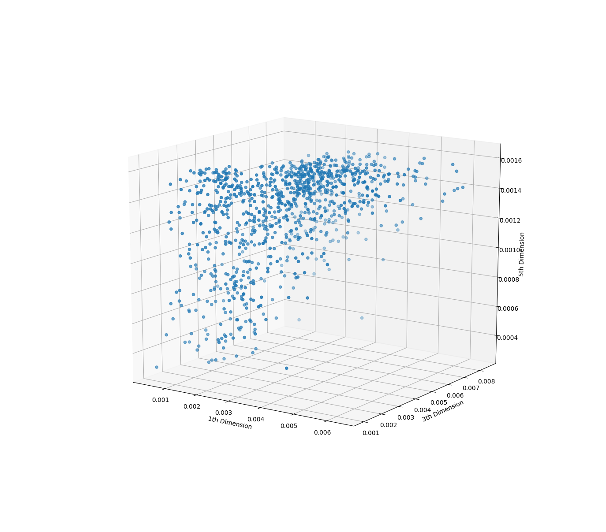
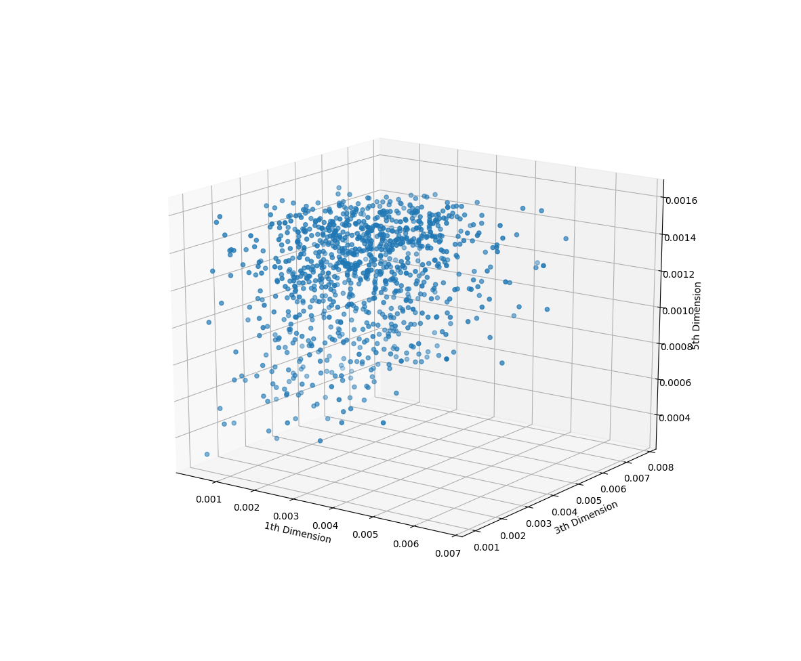
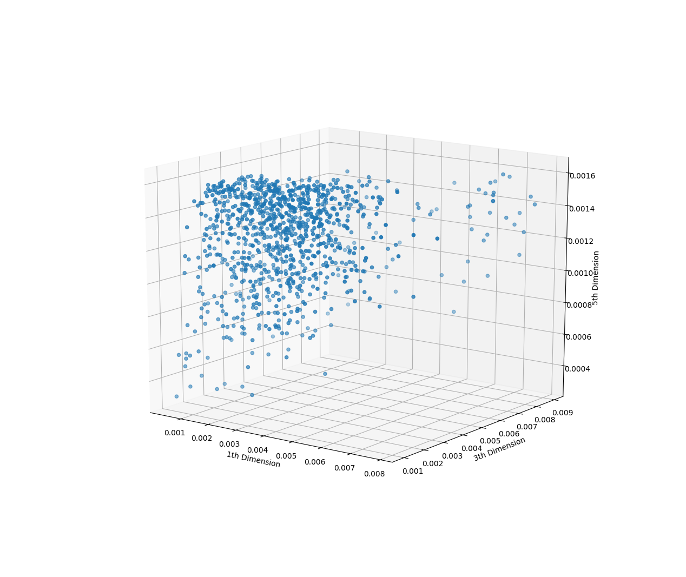
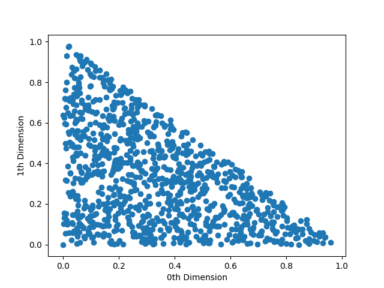
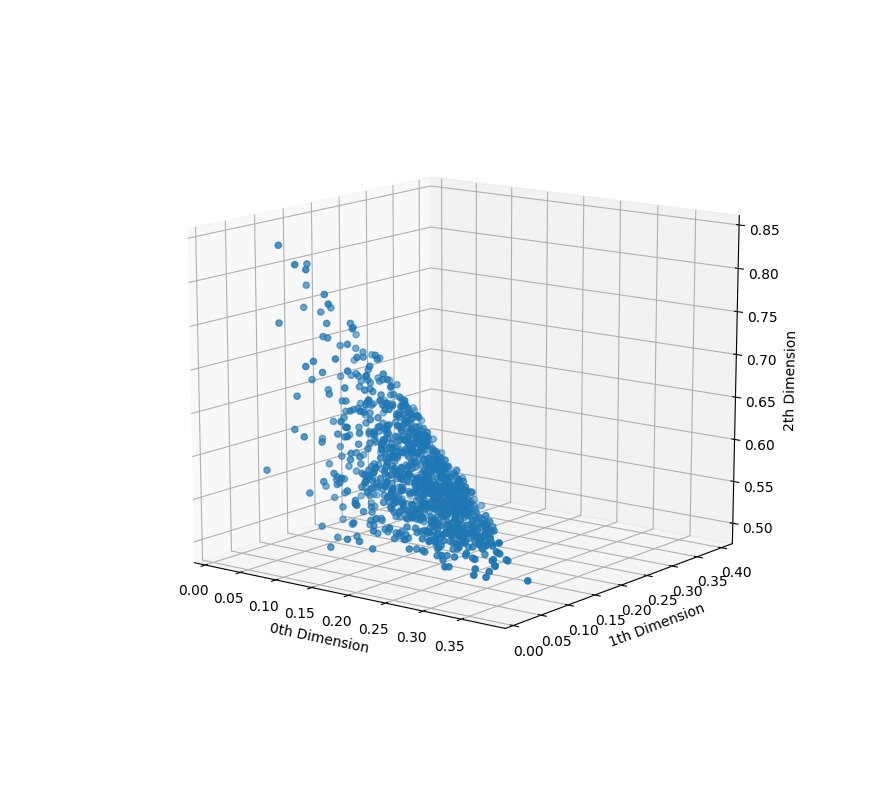

# Citrine-Challenge
Generating points within the unit hypercube subject to constraints.

Requirements:
* Python 3
* Numpy
* Matplotlib

Tested with:
* Python 3.6.7
* Numpy 1.16.1
* Matplotlib 3.0.2

Usage:  
./sampler <input_file> <output_file> <n_results> <optional_parameters>  
./plotter <output_file> <dimensions_to_plot>

For a list of optional parameters, please do:  
./sampler -h 

Examples:  
./sampler alloy.txt output.txt 1000 --decay 0.95 --steps 10 --benchmark True  

./plotter output.txt 0  
./plotter output.txt 1 3  
./plotter output.txt 3 4 6  

# Method description:
The method works by performing short random walks from points obeying constraints, automatically reducing step size with failures and increasing step size with successes.
In steps:

1. A point is picked randomly from the pool of points obeying constraints.  
For number of times equal to steps parameter (user option, default = 20):  
    2. A random move with a large step size from the point is proposed (initially anywhere within the unit hypercube).  
    3. A check is performed to see whether the proposed move is within provided constraints.  
    4. The move is accepted if it still obeys the constraints, and step size is increased or reset (user option, default = reset).  
    or  
    4. The move is rejected, and the step size is reduced by a decay parameter (user option, default = 0.99).

Picking new points and trying moves are iterated until enough points have been generated.

The method can be run without specifying any parameters, relying only on default settings. The default parameters are selected to provide a good balance between runtime and point spread.
With the default parameters, generating 1000 points on a i7-6850K @ 4.4GHz takes:  
8.8 seconds for alloy.txt  
0.03 seconds for example.txt  
0.94 seconds for formulation.txt  
0.006 seconds for mixture.txt  

The main knob adjusting speed vs sampling uniformity is the decay.  
* Increasing decay increases runtime, but also the sampling quality. Increasing it to 0.995 makes the alloy.txt benchmark take 16 seconds, but dramatically improves point spread.

Steps parameter may or may not influence speed and spread, depending on average successful steps per point.
* Decreasing steps may increase runtime, but also may increase sampling quality. Changing it to 10 makes alloy.txt benchmark take 9.3 seconds.

Systems can be benchmarked with the --benchmark True flag. A plotter tool is also included to get an idea of the quality of points spread. A few example plots are provided below.
* alloy.txt with default parameters:

* alloy.txt with decay=0.995:

* alloy.txt with steps=10:

* mixture.txt with default parameters:

* formulation.txt with decay=0.999 and steps=4:

